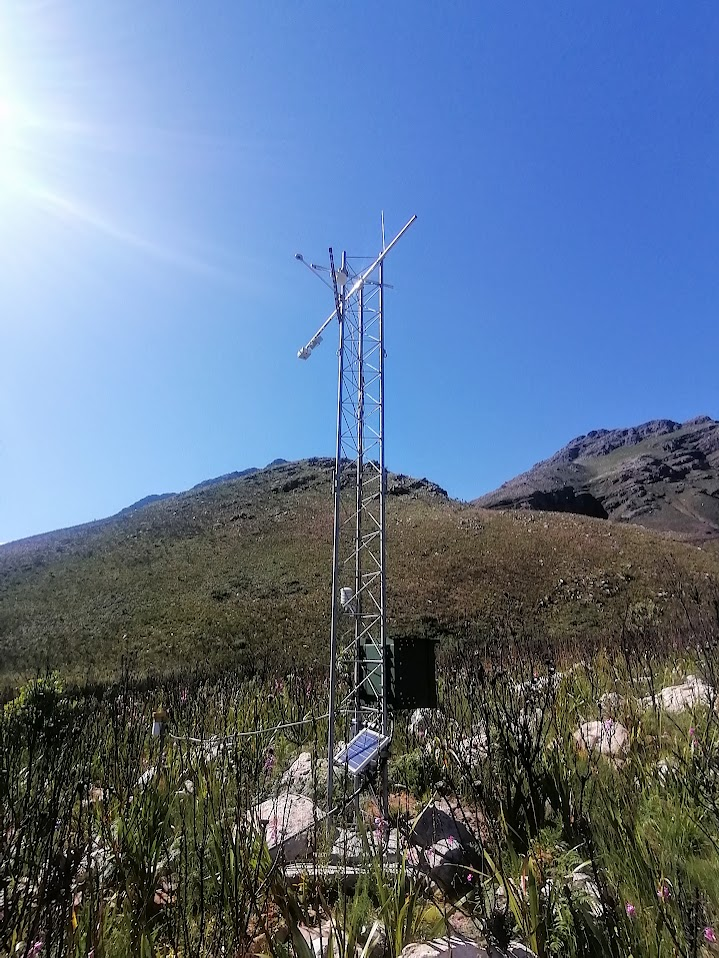

<!-- README.md is generated from README.Rmd. Please edit that file -->

```{r, include = FALSE}
knitr::opts_chunk$set(
  collapse = TRUE,
  comment = "#>"
)
```

# Jonkershoek eddy covariance

<!-- badges: start -->
<!-- badges: end -->

## Project Description

The goal of `flux_jonkershoek` is to set up a project focused on forecasting flux data from the Jonkershoek valley, South Africa, for the near-term ecological forecasting course run by the African Chapter of the Ecological Forecasting Initiative, Ecoforecast Africa (https://ecoforecast.africa/). See https://ecoforecast.africa/events/.

## Data Overview

The data are from the South African Environmental Observation Network (SAEON). The project will focus on flux data from the eddy covariance system at Swartboschkloof. These observations are part of the Jonkershoek long term study site run by the SAEON Fynbos Node (https://fynbos.saeon.ac.za/). The site has a long history of environmental observations, starting with a multiple catchment experiment in the 1940s. More details are available in Slingsby et al. 2021. Jonkershoek: Africa’s Oldest Catchment Experiment ‐ 80 Years and Counting. Hydrological Processes, https://doi.org/10.1002/hyp.14101.

The data we'll use run from from 2019 to the near-present. 



## Data Download

For this you will need to replace `"dropbox_link"` with the actual link to the data file provided as part of the course. The link should be set to allow direct download. The code below will set the link to allow direct download, download the data file and save it in your `data` directory. Note that the contents of this directory will not be tracked by git as it is told to ignore it in the `.gitignore` file.

You also need to change the R chunk setting from `eval = FALSE` to `eval = TRUE`

```{r download data, eval = FALSE}
# Create data directory if it doesn't exist
if (!dir.exists("data")) {
  dir.create("data")
}

# Dropbox link (replace with your actual link)
dropbox_link <- "dropbox_link"

download_link <- sub("dl=0", "dl=1", dropbox_link)

download.file(download_link, destfile = "data/Jonkershoek_EC_all.csv")
```

## Read the data

```{r}
library(tidyverse)

ecdat <- read_delim("data/Jonkershoek_EC_all.csv", delim = ";")
ecdat$time = lubridate::parse_date_time(ecdat$TIMESTAMP,orders = "ymd HM")
```

## Data QC

The primary variables of interest in this analysis will the the Net Ecosystem Exchange of carbon (NEE) and the Latent Energy flux (LE), which is a measure of evapotranspiration. In this file they are indicated by Fc_molar (umol/m2/s) and LE (W/m2), respectively.

Before we can use the data we need to first filter out data that does not meet quality control criteria, which are given by Fc_qc_grade and LE_qc_grade, as well as a few other sanity checks

```{r}
ecdat$LE[which(ecdat$LE > 400)] = NA ## remove implausible values
ecdat$LE[which(ecdat$LE < -100)] = NA ## remove implausible values
hist(ecdat$LE,breaks = 100)

ecdat$Fc_molar[which(ecdat$Fc_molar > 20)] = NA ## remove implausible values
ecdat$Fc_molar[which(ecdat$Fc_molar < -30)] = NA ## remove implausible values
hist(ecdat$Fc_molar,breaks = 100)

## ustar filtering
ecdat$Fc_molar[which(ecdat$u_star < 0.3)] = NA 
ecdat$LE[which(ecdat$u_star < 0.3)] = NA 

## quality control filtering
## scores defined in Appendix F of EasyFlux manual, with 1 being the best score and 9 being the worst
ecdat$Fc_molar[which(ecdat$Fc_qc_grade > 6)] = NA 
ecdat$LE[which(ecdat$LE_qc_grade > 6)] = NA 
```


## Plot the data

```{r}
plot(ecdat$time,ecdat$Fc_molar)
plot(ecdat$time,ecdat$LE)
```
While these plots do hint at the existence of a seasonal cycle, a lot of the pattern is obscured by a strong subdaily (diurnal) cycle. We can see this by averaging the flux data by time of day

```{r}
hour = lubridate::hour(ecdat$time)

NEE_diurnal = tapply(ecdat$Fc_molar,hour,mean,na.rm=TRUE)
plot(as.numeric(names(NEE_diurnal)),
     NEE_diurnal,
     xlab="hour",type='b')

LE_diurnal = tapply(ecdat$LE,hour,mean,na.rm=TRUE)
plot(as.numeric(names(LE_diurnal)),
     LE_diurnal,
     xlab="hour",type='b')
```

Unfortunately, there is also a strong diurnal bias in missing data, so naively averaging the flux data by day, week, or month will produce biased flux estimates

```{r}
NEE_NA_diurnal = tapply(ecdat$Fc_molar,hour,function(x){sum(is.na(x))/length(x)*100})
plot(as.numeric(names(NEE_NA_diurnal)),
     NEE_NA_diurnal,
     ylab="NEE % missing data",
     xlab="hour",type='b')

LE_NA_diurnal = tapply(ecdat$LE,hour,function(x){sum(is.na(x))/length(x)*100})
plot(as.numeric(names(LE_NA_diurnal)),
     LE_NA_diurnal,
     ylab="LE % missing data",
     xlab="hour",type='b')
```

## Flux climatology null model

```{r}
doy = lubridate::yday(ecdat$time)
doy[doy==366] = 365 ## eliminate leap year
NEE_clim = mgcv::gam(Fc_molar ~ te(hour,doy),data = ecdat,method = "REML")
newdata = expand.grid(hour = 0:23,doy=1:365)
newdata$predicted_NEE <- predict(NEE_clim, newdata = newdata, type = "response")

ggplot(newdata, aes(x = doy, y = hour, fill = predicted_NEE)) +
  geom_tile() +
  scale_fill_gradient2(low = "green", high = "orange",mid="white",midpoint=0) + # Customize the color scale
  labs(title = "NEE Flux Fingerprint Heatmap", x = "Day of year", y = "Time of day") # Add labels

newdata |> filter(hour %in% c(0,6,12,18)) |> 
  ggplot(aes(x=doy,y=predicted_NEE,group=hour,colour = hour)) + geom_line(linewidth=2) + 
  scale_color_gradient(low = "blue", high = "orange") ##flux seasonal cycle by time of day
```

```{r}
LE_clim = mgcv::gam(LE ~ te(hour,doy),data = ecdat,method = "REML")
newdata$predicted_LE <- predict(LE_clim, newdata = newdata, type = "response")

ggplot(newdata, aes(x = doy, y = hour, fill = predicted_LE)) +
  geom_tile() +
  scale_fill_gradient(low = "white", high = "blue") + # Customize the color scale
  labs(title = "LE Flux Fingerprint Heatmap", x = "Day of year", y = "Time of day") # Add labels

newdata |> filter(hour %in% c(0,6,12,18)) |> 
  ggplot(aes(x=doy,y=predicted_LE,group=hour,colour = hour)) + geom_line(linewidth=2) + 
  scale_color_gradient(low = "blue", high = "orange") ##flux seasonal cycle by time of day
```

## Meteorological covariates

```{r}
plot(ecdat$time,ecdat$Tc_Avg)  ## Average air temperature (C) from sonic
plot(ecdat$time,ecdat$RH_Avg) ## Relative Humidity
plot(ecdat$time,ecdat$VPD_air) ## Vapor Presure Deficit (kPa)
plot(ecdat$time,ecdat$Precipitation_Tot,type="l") ## Precipitation (mm)
plot(ecdat$time,ecdat$Rn) ## Net Radiation (W/m2, file doesn't contain downward or PAR)
```
For forecasting fluxes, one might look at how each of these affects the observed flux, or try to use them to predict deviations/anomalies relative to the climatology, or build a more mechanistic model based on photosynthesis and respiration.

