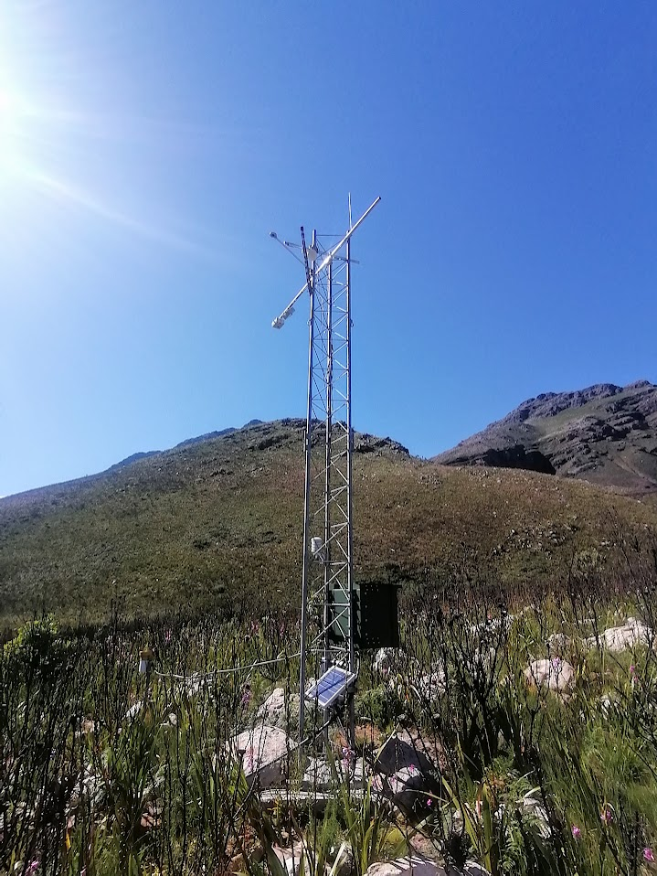

<!-- README.md is generated from README.Rmd. Please edit that file -->

# Jonkershoek eddy covariance

<!-- badges: start -->

<!-- badges: end -->

## Project Description

The goal of `flux_jonkershoek` is to set up a project focused on
forecasting flux data from the Jonkershoek valley, South Africa, for the
near-term ecological forecasting course run by the African Chapter of
the Ecological Forecasting Initiative, Ecoforecast Africa
(<https://ecoforecast.africa/>). See
<https://ecoforecast.africa/events/>.

## Data Overview

The data are from the South African Environmental Observation Network
(SAEON). The project will focus on flux data from the eddy covariance
system at Swartboschkloof. These observations are part of the
Jonkershoek long term study site run by the SAEON Fynbos Node
(<https://fynbos.saeon.ac.za/>). The site has a long history of
environmental observations, starting with a multiple catchment
experiment in the 1940s. More details are available in Slingsby et
al. 2021. Jonkershoek: Africa’s Oldest Catchment Experiment ‐ 80 Years
and Counting. Hydrological Processes,
<https://doi.org/10.1002/hyp.14101>.

The data we’ll use run from from 2019 to the near-present.

<figure>

<figcaption aria-hidden="true">The eddy covaroance system at
Jonkershoek.</figcaption>
</figure>

## Data Download

For this you will need to replace `"dropbox_link"` with the actual link
to the data file provided as part of the course. The link should be set
to allow direct download. The code below will set the link to allow
direct download, download the data file and save it in your `data`
directory. Note that the contents of this directory will not be tracked
by git as it is told to ignore it in the `.gitignore` file.

You also need to change the R chunk setting from `eval = FALSE` to
`eval = TRUE`

``` r
# Create data directory if it doesn't exist
if (!dir.exists("data")) {
  dir.create("data")
}

# Dropbox link (replace with your actual link)
dropbox_link <- "dropbox_link"

download_link <- sub("dl=0", "dl=1", dropbox_link)

download.file(download_link, destfile = "data/Jonkershoek_EC_all.csv")
```

## Read the data

``` r
library(tidyverse)
#> ── Attaching core tidyverse packages ──────────────────────── tidyverse 2.0.0 ──
#> ✔ dplyr     1.1.4     ✔ readr     2.1.5
#> ✔ forcats   1.0.0     ✔ stringr   1.5.1
#> ✔ ggplot2   3.5.2     ✔ tibble    3.3.0
#> ✔ lubridate 1.9.4     ✔ tidyr     1.3.1
#> ✔ purrr     1.0.4     
#> ── Conflicts ────────────────────────────────────────── tidyverse_conflicts() ──
#> ✖ dplyr::filter() masks stats::filter()
#> ✖ dplyr::lag()    masks stats::lag()
#> ℹ Use the conflicted package (<http://conflicted.r-lib.org/>) to force all conflicts to become errors

ecdat <- read_delim("data/Jonkershoek_EC_all.csv", delim = ";")
#> New names:
#> Rows: 67094 Columns: 88
#> ── Column specification
#> ──────────────────────────────────────────────────────── Delimiter: ";" chr
#> (3): TIMESTAMP, FP_Equation, ...88 dbl (85): RECORD, Fc_molar, Fc_mass,
#> Fc_qc_grade, Fc_samples_Tot, LE, LE_qc_...
#> ℹ Use `spec()` to retrieve the full column specification for this data. ℹ
#> Specify the column types or set `show_col_types = FALSE` to quiet this message.
#> • `` -> `...85`
#> • `` -> `...86`
#> • `` -> `...87`
#> • `` -> `...88`
```
